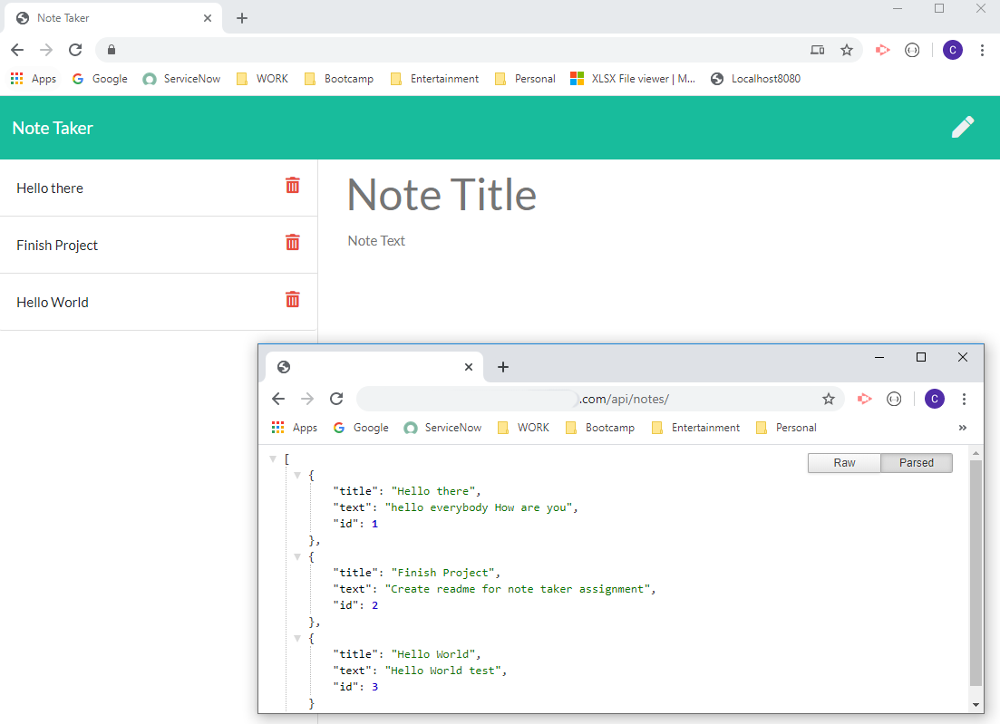

# 
Note Taker

 The project makes use of a web server created with Express JS to host a note taker application. The site should enable a user to POST and DELETE notes from the back end server database. The page should immediately return updated information with all of the saved notes from the JSON database file.

*****
## 
Table of Contents

* [Installation](https://github.com/craigfbarry/note-taker#installation)

* [Usage](https://github.com/craigfbarry/note-taker#usage)

* [License](https://github.com/craigfbarry/note-taker#license)

* [Contributing](https://github.com/craigfbarry/note-taker#contributing)

* [Tests](https://github.com/craigfbarry/note-taker#testing-framework)

* [Technologies Used](https://github.com/craigfbarry/note-taker#technologies-used)

* [Author](https://github.com/craigfbarry/note-taker#author)

* [Github URL](https://github.com/craigfbarry/note-taker#github)

* [Acknowledgements](https://github.com/craigfbarry/note-taker#acknowledgements)

*****

#### Installation

        Run npm install and then node server.js from node or run from heroku link.

#### Usage

Used to post and delete data from an online webserver.

#### License

#### Contributing

None

#### Testing framework

        None

#### Technologies used

        Node npm FS Express heroku

#### Author

[@craigfbarry](https://github.com/craigfbarry/)

#### Github URL

https://github.com/craigfbarry/note-taker

#### Acknowledgements

None

    
